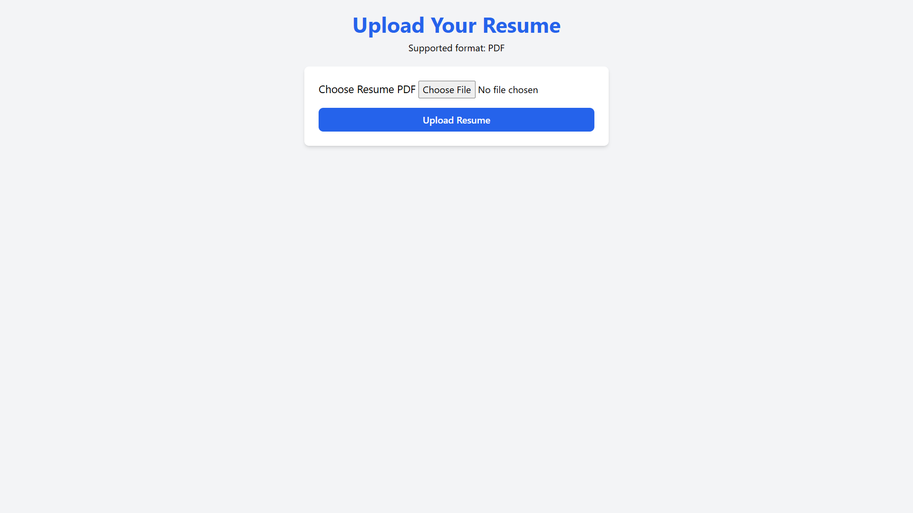
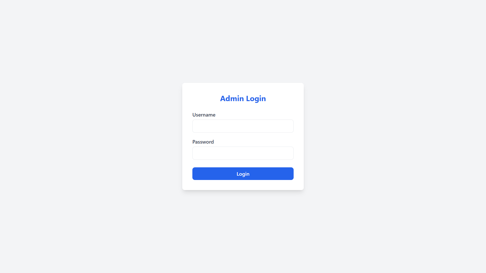

# 🧠 AI Resume Parser

An intelligent resume parser built with **Flask**, powered by **Groq's LLaMA 3** model and integrated with **MongoDB**. It extracts structured information from resumes (PDFs) such as name, contact info, skills, education, work experience, and certifications, then displays and stores the results in an admin dashboard.

## 🚀 Features

- 📄 Upload PDF resumes and extract key details using LLMs
- 🤖 Powered by **Groq API** + **LLaMA 3**
- 💾 Stores parsed data in **MongoDB**
- 🔐 Admin dashboard for managing resumes
- 📂 Fallback PDF text extraction using **PyMuPDF** if `pdfplumber` fails
- 🧑‍💼 Secure admin login and logout
- 🌐 Clean UI with Jinja2 templates and session management

---

## 📸 Screenshots

| Upload Page | Admin Dashboard |
|-------------|-----------------|
|  |  |


---

## 🛠 Tech Stack

- **Backend**: Flask
- **Frontend**: HTML, Jinja2, Bootstrap/Tailwind (optional)
- **LLM**: [Groq API](https://console.groq.com/)
- **Database**: MongoDB Atlas / Local MongoDB
- **PDF Parsing**: `pdfplumber`, `PyMuPDF (fitz)`

---

## 📥 Installation

1. **Clone the repo:**

```bash
git clone https://github.com/T-O-B-I-I/AI-Resume-Parser.git
cd AI-Resume-Parser
```
2. **Create and activate a virtual environment:**

```bash
python -m venv venv
source venv/bin/activate  # On Windows: venv\Scripts\activate
```

3. **Install dependencies:**

```bash
pip install -r requirements.txt
```

4. **Create a .env file:**

```bash
GROQ_API_KEY=your_groq_api_key_here
MONGO_URI=your_mongodb_connection_uri
ADMIN_USERNAME=admin
ADMIN_PASSWORD=yourpassword
```

5. **Run the app:**

```bash
py app.py
```
Visit http://localhost:5000 in your browser.

---

## 🔐 Admin Login
Go to: http://localhost:5000/admin

Default credentials (can be changed in `.env`):

Username: `admin`

Password: `yourPassword`

---

## 🧪 API Model & Prompting

- Uses Groq LLaMA 3 via REST API
- Sends structured prompts to extract:
  - Full Name
  - Contact Info
  - Skills
  - Education
  - Work Experience
  - Certifications

Prompt structure is defined inside the `parse_resume()` function in `app.py`.

---

## 🐞 Known Issues

- Some resumes may have poor text extraction if the formatting is complex.
- MongoDB SSL handshake errors may occur if Atlas is not configured correctly.
- Hosting on platforms like Vercel may require converting this to a FastAPI/Streamlit app or using Gunicorn.

---

## 🍛 Deployment

For production deployment:

1.Replace app.run(debug=True) with a production WSGI server like Gunicorn:

```bash
gunicorn app:app
```
2.Host it on:

- Render
- Railway
- Fly.io
- Heroku
- or a VPS

---

## 🤝 Contributing

Pull requests are welcome! For major changes, open an issue first to discuss what you’d like to change.

---

## 🌟 Acknowledgments

- [Groq API](https://console.groq.com/)
- [MongoDB Atlas](https://www.mongodb.com/cloud/atlas)
- [pdfplumber](https://github.com/jsvine/pdfplumber)
- [PyMuPDF](https://github.com/pymupdf/PyMuPDF)

---

## 👤 Author
Ankush Sahoo
[LinkedIn](https://www.linkedin.com/in/ankush-sahoo-51a973158/) | [GitHub](https://github.com/T-O-B-I-I)
